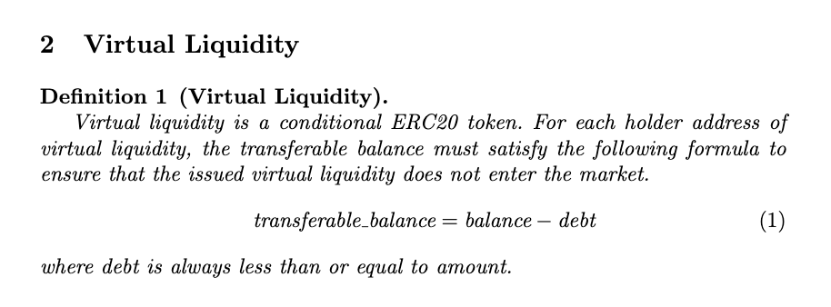

## Lambo Virtual-Liquidity

## Introduction
In the realm of cryptocurrency, liquidity is paramount, especially for nascent Meme projects. Liquidity refers to the ease with which assets can be bought or sold in the market without affecting their price. For cryptocurrency projects, having sufficient liquidity is crucial for several reasons.

To search for an efficient, near-zero cost liquidity solution for token launch, we propose a straightforward mechanism: the concept of virtual liquidity to meet the liquidity needs of project parties. We will establish a deep liquidity pool on Curve to satisfy the liquidity exit for users' buying and selling activities. Essentially, this mechanism involves whales providing liquidity to retail investors. Liquidity providers can earn profits through LP fees, creating a win-win situation where whales earn LP fees and retail investors/developers resolve their liquidity issues.

We believe this mechanism can enhance the liquidity returns for DeFi whales while simultaneously addressing the liquidity challenges faced by retail investors and developers.

## Virtual Liquidity

